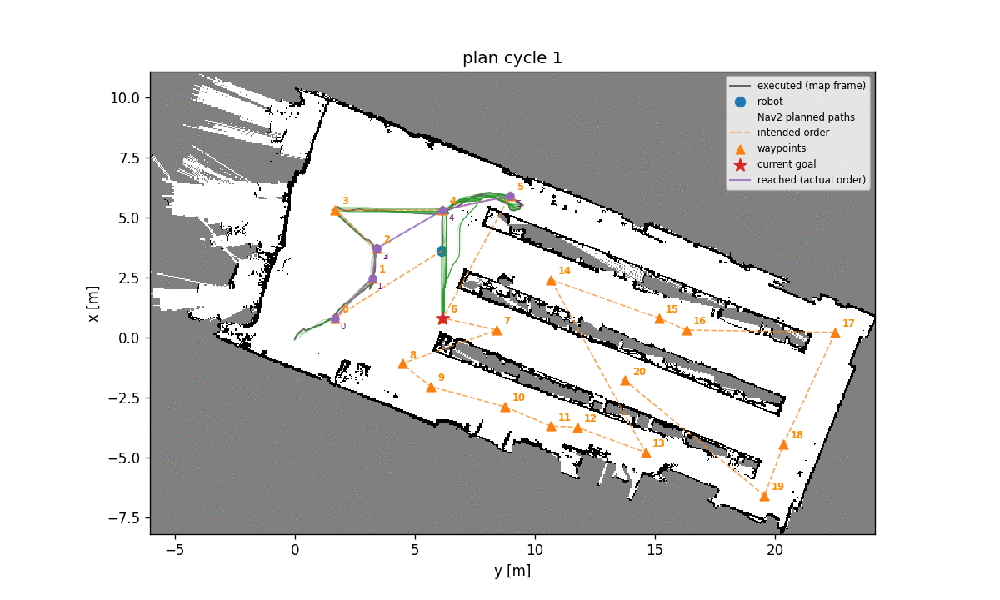

# Travis exploration

Autonomous visual exploration for indoor mobile robots on ROS 2 Jazzy and Nav2: the robot decides on its own where to drive and where to point its camera so that it sees as much of the floor as possible, with or without a map.



## What this repo is about

Manually inspecting a space is slow, repetitive and easy to get wrong: corners get missed, aisles get skipped. This stack hands that "go look around" job to the robot, as the first step before any task that needs to understand what is in the environment.

It is **coverage planning, not classic frontier exploration**. The planner reasons about which floor cells the camera has actually seen, not just where the map boundary is:

1. Lay candidate viewpoints over every spot the robot's body fits.
2. Pick the smallest set of viewpoints that together see (almost) the whole floor, using a greedy set cover weighted by wall-aware travel distance.
3. Visit them in a short order, recording camera coverage continuously while driving and arriving already facing the most unseen direction.


It works in two modes: **known-map** (a floor plan is given, maximise camera coverage) and **SLAM** (the map is built live, frontiers drive the replanning). It is built for real robots: a human can take over at any time without ending the run, Nav2 failures are checked against the real robot pose, and a restarted Nav2 is reconnected automatically.

**Results.** Each autonomous run is compared to a human driving the same robot through the same environment (setting Nav2 goals by hand). "Floor seen" is how much the robot observed, as a share of what the human observed: 100% means it saw as much as the human. "Distance driven" is the mean path length of the robot against the human's. Full details in the [results report](docs/exploration_system_results_and_explanation/Report_exploration.md).

| Environment | Map mode | Runs | Floor seen, relative to human | Distance driven, robot vs human |
|---|---|---|---|---|
| House, 157 m², simulated | SLAM | 6 | 97% | 55.9 m vs 50.3 m (11% more) |
| House, 157 m², simulated | known map | 4 | 97% | 43.3 m vs 46.2 m (6% less) |
| Ghent warehouse, ~220 m², **real robot** | SLAM | 3 | 94.5% | 164.4 m vs 127.2 m (29% more) |
| Ghent warehouse, ~220 m², **real robot** | known map | 3 | 96.3% | 108.8 m vs 91.7 m (19% more) |
| Hospital, ~1170 m², simulated | known map | 4 | 87% | 424.5 m vs 426.4 m (same) |
| Hospital, ~1170 m², simulated | SLAM | 1 | 92% | 845.9 m vs 426.4 m (98% more) |

The robot front-loads the work: in the house it reaches half its final coverage in 54% of the human's distance, covers the whole house in under 7 minutes, and needed no human help across 10 house runs. Its known weak spots are large buildings (the hospital plateaus at 70 to 80% coverage, and SLAM there crosses the building back and forth) and the endgame, where much of the driving goes into the last few percent. See [Current limitations](docs/exploration_system_results_and_explanation/Report_exploration.md#current-limitations).

**This repo is for you if** you need a robot to autonomously observe an indoor space with a camera, want a Nav2-based exploration you can run in simulation and on a real MiR250, or want a tested, measured baseline to compare your own exploration strategy against.

Further reading: [V2.0 conceptual overview](docs/exploration_V2.0_overview.md), [results report](docs/exploration_system_results_and_explanation/Report_exploration.md), [exploration package README](ros2_ws/src/navigation/exploration/README.md).

## Table of contents

- [What this repo is about](#what-this-repo-is-about)
- [Packages overview](#packages-overview)
- [Build](#build)
- [Launch files](#launch-files)
- [Saving a map (SLAM mode)](#saving-a-map-slam-mode)
- [How exploration works](#how-exploration-works)
  - [Safety nets for the real robot](#safety-nets-for-the-real-robot)
- [Testing](#testing)
- [Global planner configuration](#global-planner-configuration)
- [Speed tuning](#speed-tuning)

---

## Packages overview

| Package | Role |
|---|---|
| `nav2` | Navigation stack (path planning, costmaps, AMCL localisation) |
| `exploration` | Coverage-planning exploration node ([package README](ros2_ws/src/navigation/exploration/README.md)) |
| `semantic_map` | Semantic map package |
| `perception` | Panoramic laser scan aggregation from dual LiDARs |

Two robots are supported in nav2, with separate Nav2 parameter files: **MiR250**
(`nav2_mir_jazzy_params.yaml`, inflation 0.6) and **TurtleBot3**
(`nav2_turtle3_jazzy_params.yaml`, inflation 0.4). Pass any robot adapted nav2 confiuration you want via the
`nav2_params` launch argument; MiR is the default.

---

## Build

Before starting, allow the containers to open windows (RViz, Gazebo) on your screen:
```bash
xhost +local:docker
```

```bash
docker compose up -d 
docker exec -it TRAVIS_ros2jazzy bash
```
The ros workspace should be colcon build while the docker is composed. But if required:
```bash
cd /ros2_ws
colcon build --symlink-install
source install/setup.bash
```

---

## Launch files


### 1. `exploration_nav2.launch.py`, Full stack 

Starts Nav2, panoramic_lidar, rviz2 and the exploration node together. 

```bash
# SLAM mode, robot explores while building the map
ros2 launch exploration exploration_nav2.launch.py

# Known-map mode, robot explores a known environment
ros2 launch exploration exploration_nav2.launch.py map_dir:=/ros2_ws/src/assets/maps/lab_05
```

The `map_dir` folder must contain exactly one `.pgm` and one `.yaml` file. The YAML is forwarded to Nav2 (AMCL); both files are forwarded to the exploration node.

**Is it working?** RViz should open and show the map growing and the robot moving as it explores. To check without RViz, or to confirm the exploration node itself is alive:
```bash
ros2 topic echo /exploration/status --once
```
This should print a JSON status payload, not hang or error.


### 2. `nav2.launch.py`, Nav2 stack only

Starts Nav2 (path planner, controller, costmaps, LiDAR) without the exploration node + starts the panoramic lidar scan process

```bash
# SLAM mode, builds map live with slam_toolbox
ros2 launch nav2 nav2.launch.py

# Known-map mode, localises on a pre-built map with AMCL
ros2 launch nav2 nav2.launch.py map:=/ros2_ws/src/assets/maps/lab_05/map.yaml

# Known-map mode, localises with slam_toolbox instead of AMCL (needs a saved pose-graph, see below)
ros2 launch nav2 nav2.launch.py map:=/ros2_ws/src/assets/maps/lab_05/map.yaml \
    localization:=slam_toolbox serialized_map:=/ros2_ws/src/assets/maps/lab_05/map
```

`localization` (`amcl` | `slam_toolbox`, default `amcl`) picks the known-map localisation backend; ignored in SLAM mode. Use `slam_toolbox` when AMCL's particle filter loses the robot in narrow, feature-poor spaces like aisles. It requires `serialized_map`, the pose-graph stem (no extension, e.g. `.../lab_05/map` for `map.posegraph`/`map.data`) produced by `save_map.sh`, see "Saving a map" below. `base_frame` and `scan_topic` also only apply to slam_toolbox and default to the simulator's `base_footprint`/`/panoramic/scan`; set them to `base_link`/`/scan` on the ROSbot XL.

### 3. `exploration.launch.py`, Exploration node only

Starts the exploration node and RViz2. 
Does **not** start Nav2. Use this when Nav2 is already running separately.

```bash
# SLAM mode, no map, exploration builds one live
ros2 launch exploration exploration.launch.py

# Known-map mode, provide a folder containing a .pgm and .yaml file
ros2 launch exploration exploration.launch.py map_dir:=/ros2_ws/src/assets/maps/lab_05
```

### Common launch arguments

| Argument | Default | Meaning |
|---|---|---|
| `map_dir` | `''` | Folder with one `.pgm` + one `.yaml`. Empty = SLAM mode |
| `nav2_params` | MiR params | Which robot's Nav2 config to load (MiR or TurtleBot3) |
| `use_sim_time` | `true` | **Must be `true` in simulation.** See the warning below |
| `use_rviz` | `true` | `false` for headless runs. RViz is decoupled into `rviz.launch.py` |

> **`use_sim_time` is the first thing to check when this stack misbehaves.** If it is missing on the panoramic laser or exploration nodes, the SLAM map appears frozen and the robot spins in place. It is set explicitly in the launch files; verify it survived any change you make.

---

## Saving a map (SLAM mode)

There are two save paths, producing different artifacts. Which one you need depends on how you plan to localise later.

**Grid only (enough for known-map mode with AMCL):**

```bash
ros2 run nav2_map_server map_saver_cli -f ~/map --ros-args -p map_subscribe_transient_local:=true
```

This creates `~/map.pgm` and `~/map.yaml`. Move them into the asset folder outside the ros2 workspace.

**Grid + pose-graph (required for known-map mode with `localization:=slam_toolbox`):**

```bash
ros2 run nav2 save_map.sh /ros2_ws/src/assets/whatever_asset map
```

While Nav2 is running in SLAM mode, this calls slam_toolbox's own save services and writes `map.pgm`, `map.yaml`, `map.posegraph` and `map.data` into `out_dir`, all from the same instant. The `.posegraph`/`.data` pair is the scan-matching graph slam_toolbox needs to localise later, this is what makes `localization:=slam_toolbox` more robust than AMCL in narrow, feature-poor spaces like aisles, and it cannot be regenerated from the `.pgm`/`.yaml` alone. `map_saver_cli` never produces it. See `nav2/scripts/save_map.sh` for exit codes and the Docker path-resolution caveat.

---

## How exploration works

This is **coverage planning**, not classic frontier exploration. The goal is to *visually observe* the environment with the camera, so the planner reasons about which cells the camera has actually seen, not just where the map boundary is.
Frontiers are one term in the score, and they matter mainly in SLAM mode.

1. The exploration node subscribes to `/map` (published by slam_toolbox in SLAM mode, or map_server in known-map mode).
2. It samples a grid of **candidate viewpoints** across navigable space, and ray-casts from each to compute what the camera would see (coverage cells) and which unknown cells it would reveal (frontier cells).
3. A **greedy set cover** picks the viewpoints that add the most unseen area, scored as `gain × exp(-γ × distance)` so nearby candidates are preferred. The selected waypoints are ordered by wall-aware (not Euclidean) distance.
4. Each waypoint is sent to Nav2 via the `navigate_to_pose` action, with the goal **yaw aimed at the most-uncovered direction**. Nav2 drives the robot there.
5. The camera FOV is marked **continuously along the path** (every `observe_step_m`), so coverage accrues while moving rather than only at goals. On arrival the robot takes one look and moves on, no spin.
6. Under SLAM the node replans every `replan_every_n_step` arrivals so later waypoints are chosen from the freshly revealed map.
7. Exploration ends when no frontiers remain **and** coverage ≥ `exploration_completion_threshold` (0.90), or via the SLAM no-progress guard, or when the robot is genuinely wedged.

Setting `see_while_moving: false` restores the older behaviour: drive heading-blind,
then rotate through a set of headings at each waypoint.

The exploration node loads its parameters from `exploration/config/exploration_system_parameters.yaml` and camera/LiDAR parameters from `perception/config/perception_system_parameters.yaml`. Every parameter is documented inline in that YAML.

### Safety nets for the real robot

A real run does not stop being useful the moment Nav2 misbehaves. Three mechanisms keep exploration alive: a human can teleop the exploration at any time, a failed goal is double-checked against the actual robot pose, and a dead Nav2 or a broken TF tree is detected and recovered instead of hanging the run forever. All three are on by default and tuned in `exploration_system_parameters.yaml`.

**1. Manual assisted exploration: drive the robot yourself; exploration keeps going**

When the robot is stuck (wedged in a doorway, Nav2 refusing a waypoint, a chair in the way), or just the user does not want the robot to go to a certain place, the human can decide to teleop the robot without killing the run (exploration still runs underneath, just no Nav2 call):

```bash
# take control: exploration stops sending Nav2 goals, you drive
ros2 topic pub --once /exploration/teleop_enabled std_msgs/Bool "{data: true}"

# ... drive with your usual teleop (joystick, teleop_twist_keyboard, MiR web UI) ...

# give control back: exploration replans from wherever you parked the robot
ros2 topic pub --once /exploration/teleop_enabled std_msgs/Bool "{data: false}"
```

While teleop is enabled, the node keeps planning and keeps **marking camera coverage as you drive**, so nothing observed by hand is lost. Driving to within `arrival_tolerance_m` (0.x m, any orientation) of the current waypoint counts it as reached, and the plan moves on by itself. Publishing `false` cancels the rest of the current plan and replans from the robot's current position.

The switch is **edge-triggered state, not a heartbeat**: publish once, and the mode persists, with no republishing and no timeout. Re-publishing the value already held does nothing.

**2. Arrival failsafe: a Nav2 failure is not proof the robot did not arrive**

Nav2 reporting ABORTED does not mean the waypoint was missed: the robot often stops just outside Nav2's own goal checker, or a human drives it the last stretch. Instead of trusting Nav2's verdict, the node enters a `VERIFYING` state and decides from the **TF pose** (`map -> base_frame`, deliberately not odometry, which drifts under SLAM).

- Within `arrival_tolerance_m` (0.x m, yaw ignored) → waypoint credited as reached.
- Otherwise the node waits until the robot has been **still** for `arrival_verify_timeout_s` (x s) before declaring failure. This is a stillness timeout, not a wall clock: any motion above `arrival_motion_eps_m` (0.05 m) restarts it, so a human intervention (teleop, no need to use teleop_enabled for a human safety intervention) can keep the window open as long as they need.
- Only aborts the failsafe could *not* rescue count toward `abort_blacklist_after` (n number of tries), after which a persistently unreachable waypoint (inside a wall or inflation layer) is blacklisted instead of being re-picked forever.

Set `arrival_verify_timeout_s: 0.0` to disable the failsafe and restore immediate-abort behaviour.

**3. Nav2 / TF watchdog: survive a Nav2 restart mid-exploration**

Nav2 can be restarted (or can silently die) while exploration runs, and the node recovers on its own:

```bash
# safe to do mid-run; exploration re-links to the restarted server
ros2 launch nav2 nav2.launch.py robot:=turtle3
```

Two failure modes are covered: a Nav2 that dies silently mid-goal, and a TF tree that stops resolving after the other container restarts. Both are governed by `nav2.watchdog_enabled` and `nav2.watchdog_stall_timeout_s`; the mechanics are in the [package README](ros2_ws/src/navigation/exploration/README.md#failure-handling-and-stop-conditions).

Node state, including the current teleop flag, is published on `/exploration/status` for monitoring.

---

## Testing

Three levels, described in full in the [exploration package README](ros2_ws/src/navigation/exploration/README.md):

```bash
cd ros2_ws/src/navigation/exploration

pytest tests/test_navigation_exploration_*.py -v   # L1: 218 unit tests, ~2.5 min, no ROS
pytest tests/ -v -s                                # L2: + offline integration (slow) ~15-20min
```

L3 is end-to-end runs of the real stack in a simulator, recorded then evaluated offline against a per-scene baseline, see [tests/system/README.md](ros2_ws/src/navigation/exploration/tests/system/README.md). `tests/algo_evaluation/` holds the offline A/B harnesses that produced the current parameter defaults; they are experiments, not pass/fail gates.

---

## Global planner configuration

The global planner is configured in [nav2/config/nav2_mir_jazzy_params.yaml](ros2_ws/src/navigation/nav2/config/nav2_mir_jazzy_params.yaml) under `planner_server`.

### Current setup, SMAC planners

Three SMAC planners are registered and available by name:

| Name | Plugin | Best for |
|---|---|---|
| `SmacHybrid` | `SmacPlannerHybrid` | Smooth, kinematically feasible paths (default) |
| `SmacLattice` | `SmacPlannerLattice` | State-lattice motion primitives |
| `Smac2D` | `SmacPlanner2D` | Simple 2D grid search |

The default planner used by Nav2's BT XML is `SmacHybrid`, set via:
```yaml
bt_navigator:
  ros__parameters:
    default_nav_to_pose_bt_xml: "/ros2_ws/install/nav2/share/nav2/config/navigate_to_pose_w_replanning_and_recovery.xml"
```


#### Fallback, switching to GridBased (NavFn)

If SMAC planners cause issues (slow planning, no path found in cluttered spaces), switch to the simpler NavFn planner:

**Step 1**, in `nav2_mir_jazzy_params.yaml`, change `planner_plugins`:
```yaml
planner_server:
  ros__parameters:
    planner_plugins: ["GridBased"]
    GridBased:
      plugin: "nav2_navfn_planner::NavfnPlanner"
      tolerance: 0.5
      use_astar: false
      allow_unknown: true
```

**Step 2**, remove or comment out `default_nav_to_pose_bt_xml` from `bt_navigator` (the default Nav2 BT XML already uses `GridBased` by name):
```yaml
bt_navigator:
  ros__parameters:
    # default_nav_to_pose_bt_xml: ...   # comment this out
```

or change in the xml file
```xml
default_planner="SmacHybrid"
```
to:
```xml
default_planner="GridBased"
```

---

## Speed tuning

Robot speed is controlled in two places in `nav2_mir_jazzy_params.yaml`:

- `controller_server` → `FollowPath` → `max_vel_x` / `max_speed_xy`, local planner limit
- `velocity_smoother` → `max_velocity`, final hardware cap (format: `[x, y, theta]`)

Both values must be updated together to take effect.

Inflation radius is **per robot**: 0.6 in `nav2_mir_jazzy_params.yaml` (MiR250) and lower in `nav2_turtle3_jazzy_params.yaml` (TurtleBot3), set on both the local and global costmap. Adapt if the robot footprint changes.

**MiR reversing.** The MiR config *prefers* forward motion but still allows reverse by design (`PreferForward` weight 2.0, `PathAngle` mode 1, `vx_min` -0.2, Lattice `allow_reverse_expansion` false). This is deliberately **not** forward-only.

**Goal yaw tolerance.** With `see_while_moving` on (the default), the exploration node aims the goal yaw at the area it most wants to see. Nav2 needs `yaw_goal_tolerance` ≈ 0.35 rad for the robot to actually end up facing that heading; a tighter or much looser value wastes the aimed look.


### `manual_exploration.launch.py`, Human-driven baseline

Starts the coverage-recording node and RViz with the **same assembled parameters** as the autonomous node, but no automatic goals: you drive the robot yourself. Used to record the human reference run that autonomous runs are scored against.

```bash
ros2 launch exploration manual_exploration.launch.py map_dir:=/ros2_ws/src/assets/maps/lab_05 use_sim_time:=true
```
