# Autonomous exploration: how it works and what the tests show

This document explains the TRAVIS autonomous exploration system and justifies/explain the exploration with measured evidence in simulation.

What follows is the system-level picture: what the exploration does well, where it degrades, which failures belong to the navigation stack rather than to the exploration strategy, what changes on a real robot, and what the next iteration could fix.

The evidence base is 20 recorded runs across two simulated environments (a house 157m^2 and hospital >1170m^2), plus 6 recorded runs on a real robot in a warehouse (~220m^2, the Ghent lab), plus 5 human-driven reference runs (with slam and known map). 

---

## Table of contents

- [What the system does](#what-the-system-does)
- [How it works](#how-it-works)
- [Test protocol and metrics](#test-protocol-and-metrics)
- [Results](#results)
- [What the system does well](#what-the-system-does-well)
- [Current limitations](#current-limitations)
- [Runs that did not finish](#runs-that-did-not-finish)
- [Limitations brought by Nav2](#limitations-brought-by-nav2)
- [Real-robot considerations](#real-robot-considerations)
- [Provenance and how to read the raw evidence](#provenance-and-how-to-read-the-raw-evidence)

---

## What the system does

The robot is placed in a building and must `look` at all of it, autonomously, without being told where to go. The system decides where the robot should stand, in what order it should visit those places, and when the job is done.

It answers three questions, repeatedly, for as long as the run lasts:

1. **Where could I usefully stand?** Positions the robot can physically reach and from which it would see something.
2. **Which few of those positions let me see the most?** A small subset that together covers as much of the building as possible, rather than a dense sweep of everywhere.
3. **In what order should I visit them?** An order that keeps driving distance low, measured through the building's corridors rather than in a straight line through walls.

The distinction that matters to an operator is between *mapping* and *coverage*. A mapping run only needs the sensor to touch every surface. This system is built for `visual coverage`: the robot must have been able to have a good look at each part of the map, This restriction is applied to marry with a semantic mapping and detection. This stricter goal (coverage over mapping) explains several of the trade-offs described later.

The video `media/exploration_steps.mp4` shows the full planning sequence on a real map (~220m square). The sections below explain what it shows.

---

## How it works

### Reading the map

Everything starts from an occupancy map, either supplied in advance (known-map mode, no SLAM) or built live by SLAM as the robot drives (SLAM mode). The map is separated into layers.

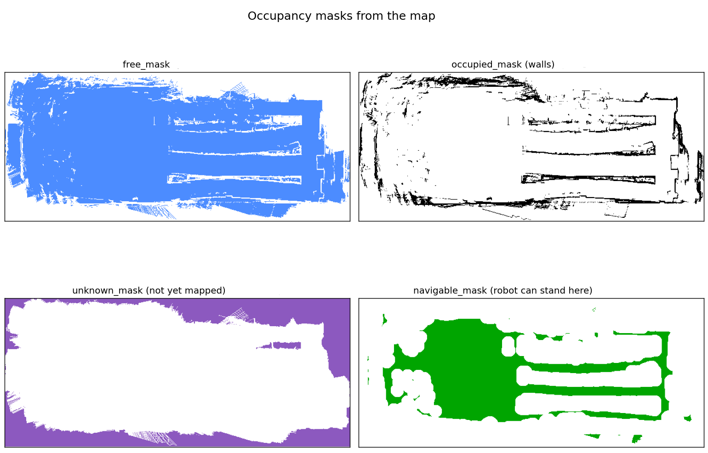

The four panels are, in reading order:

- **free** : floor the robot knows is empty.
- **occupied** : walls and obstacles.
- **unknown** : not yet mapped. 
- **navigable** : where the robot's can actually move from where it is located.

The last panel consider the inflation radius of nav2 directly. space too close to an obstacle will not be considered for planning. It is why some rooms in a large building end up written off entirely if the inflation radius is large enough to fully block the door access, the planning will not consider the adjacent rooms accessible from its position. 

Alongside these layers the system keeps a **covered mask**: a persistent record of which floor cells the robot has already looked at. This is the memory of the run, and it survives the map growing underneath it during SLAM. It considers the type of camera being used (range and FOV) to consider if an area has had the potential to be well viewed. 

### Choosing where to stand

Candidate standing positions are sampled across the navigable area. For each candidate, the system casts rays outward to work out what would become visible from there (that hasn't already been), distinguishing floor it would newly cover from unknown space it would newly reveal. Each candidate then gets a score combining how much it would reveal against how far the robot must drive to reach it, so a rich viewpoint far away can lose to a decent viewpoint nearby.

Positions are then chosen one at a time. The following three frames are one round of that process, round 3 of 22 on this map.

**(a) Score every remaining candidate.**

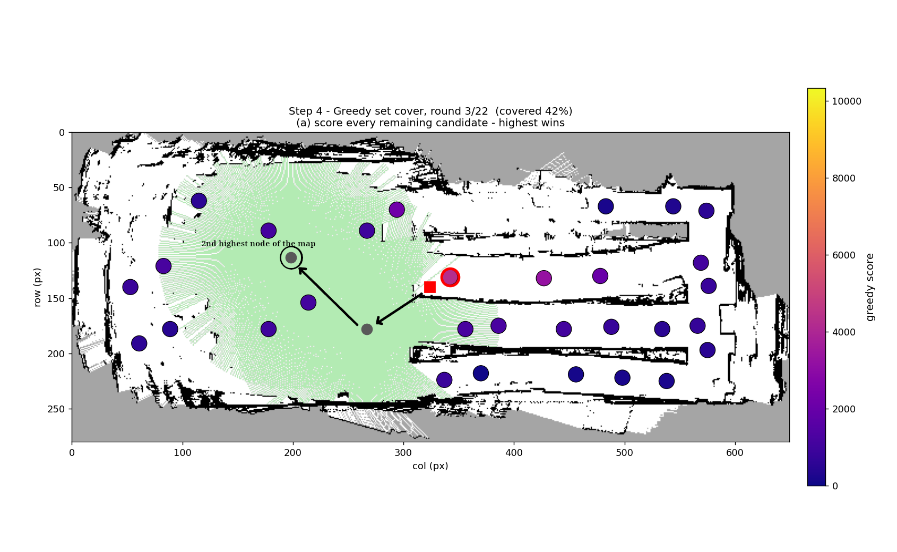

Every candidate is coloured by its score, bright for high and dark for low. On this image we are already at the 3rd repeat of the process, we select the 3rd highest scored node of the map (here, near the robot).

**(b) Pick the best one.**

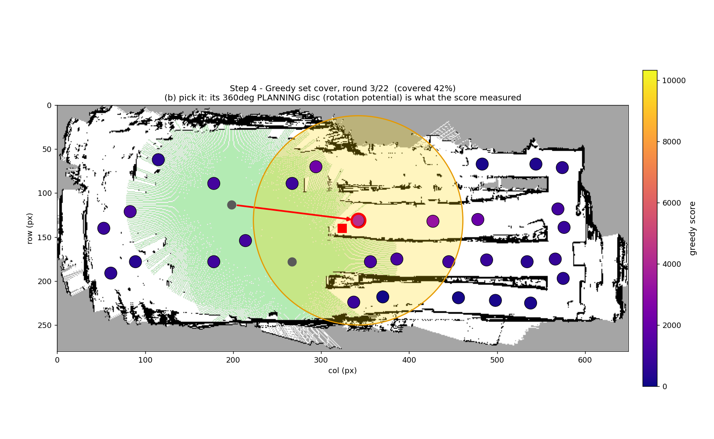

The highest-scoring candidate is selected, ringed in red, with an arrow from the previous pick. The circle is what the score measured. Potential coverage stands at 42% of the map after this pick.

Note the caption on the frame: this disc is the **planning** abstraction, a full 360 degrees of rotation potential. The real camera sees only 87 degrees at a time, and at execution the robot arrives at a given orientation and does not spin through every angle. That gap between what planning assumes and what execution delivers is deliberate and cheap to compute (but has its limitations, discussed in "Current limitations").

**(c) Absorb it and re-score.**

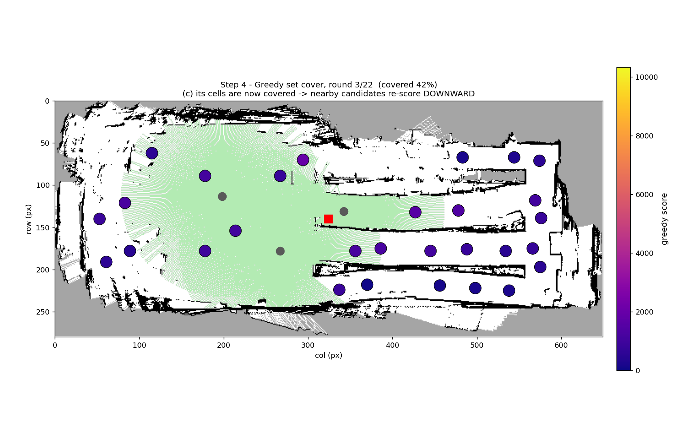

The cells that pick would see are now marked covered, and every remaining candidate is scored again against what is *left*. Compare with frame (a): the bright candidates near the new pick have collapsed to dark blue, because their value was largely the same floor. This is what stops the robot from choosing several viewpoints that all look at the same room.

The loop repeats until the remaining candidates stop being worth a dedicated stop.

### Ordering the visits

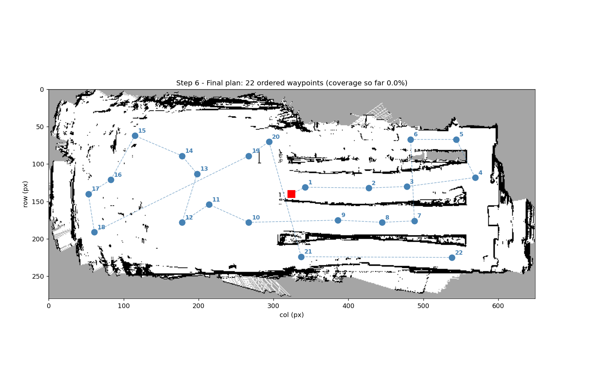

The chosen positions are then put in a driving order. Distances are measured through the building rather than straight-line, so two points on opposite sides of a wall are correctly treated as far apart. The figure contrasts this with naive straight-line ordering, which produces tours that look shorter on paper and are longer to drive (visible in the video below).

What planning produces is an ordered list of positions. 

<video src="media/exploration_steps.mp4" controls muted loop width="100%"></video>

The full planning sequence, start to finish. If the player above does not render, open [media/exploration_steps.mp4](media/exploration_steps.mp4) directly.

### Running it

The plan is executed one waypoint at a time through the navigation stack.While travelling, if another waypoint becomes much closer than the current target (a user-set distance), the robot abandons the current leg and replans from where it stands.

When the robot is about to be dispatched to a waypoint, the system works out which direction from that position would reveal the most floor that is *still* uncovered by the camera, and sends that heading as part of the goal. The waypoint handed to the navigation stack is therefore a full pose, position and orientation, and the robot is driven so that it arrives already facing what it came to look at. If the viewpoint has nothing left to reveal by then, no rotation is requested at all.

**The robot sees while it drives.** The camera field of view is recorded continuously along the path, every 0.5 m of travel, so everything the robot passes counts as covered. The robot arrives facing the area it came for, takes that single look, and moves on. 

While SLAM is active, after every N waypoints reached (N being user-set), the path is replanned to consider the map growth.

"Current limitations" shows that this replanning behaves very differently at small and large scale.

---

## What the system does well

The same system runs unmodified across very different environments: a small open-plan house, a large partitioned hospital, and a warehouse (the warehouse runs are not evaluated here -time constraint-). Nothing is tuned per building: the same parameters, the same planner and the same stop conditions are used throughout, and what changes between scenes is the map it is given.

The robot goes to the informative places first.
Half the final coverage is achieved in 54% of the baseline's distance in house SLAM and 57% in house known-map. The robot does not sweep uniformly; it picks the viewpoints that see the most and takes them early. Operationally this means an interrupted run still returns most of the value.

In large, low clustered environment such as the house (157m^2), the autonomous exploration does almsot as well as a manual exploration, with 97% the baseline in both mapping modes, with the known-map cohort doing so in 94% the distance (the human baseline exploration will be explained later)

Idle time is 55% the baseline in house SLAM. A human pauses to decide where to go next using Nav2, it takes a few seconds to observe the goal is reached, while the robot reacts immediately. This gap will widen in favour of the robot on any task where the operator is doing something else as well.
 
Under SLAM the map grows and shifts as new area is discovered. The record of what has already been seen is re-anchored as this happens, rather than being invalidated. Without this the robot would forget its progress each time the map resized.

The exploration can fail safely and recovers with minimal help. When the navigation stack cannot move the robot, the system does not thrash silently or corrupt its own state. It reports that the robot needs to be moved, waits, and resumes automatically once the robot is somewhere it can plan from again. The recommended intervention is teleoperation rather than pushing or lifting, because driving the robot keeps its odometry consistent and preserves the map (and usually nav2 stucks the robot in inflated areas rather than hit an obstacle and flip the robot). In the house runs this never triggered; in the hospital runs it did a few times.

---

## Current limitations

### The exploration stop conditions

The search phase is efficient. The finish is not. In house SLAM, **37% of the total distance driven on average happens after 90% coverage is already reached**, ranging from 10% to 52% across runs, against 12% for the human baseline. In house known-map it is 20%.

The cause is structural. Once the building is broadly covered, what remains is not rooms but slivers: narrow strips behind furniture, and fragments left by the difference between the 360-degree disc the planner scored a viewpoint on and the 87-degree camera that actually arrived there facing one direction. Each fragment is individually too small to justify a dedicated stop, but the system has no notion of diminishing returns, so it keeps assigning stops to them.

A human operator simply decides the room is done. The system currently cannot: it stops only when its conditions clear, in known-map mode 90% of the reachable area observed, in SLAM the same coverage plus *essentially* (there is a bit of flexibility) no frontiers left, with a secondary stop when three waypoints in a row each add under 0.5%. Those conditins could be reviewed.

**To improve.** Two changes, and they are the two that would most change how the system reads to an operator. First, add a diminishing-returns criterion that ends the run, or abandons a region, once the coverage gained per metre driven falls below a threshold: this is the largest single efficiency gain available and is largely independent of everything else on this page. Second, replace "no frontiers remain" with a progress-based completion test, so a run ends when it stops gaining rather than when it has exhausted a list it can never exhaust. Together they make runs shorter and make them end properly, which also makes the results of large runs far easier to interpret.

### Large buildings plateau

Hospital coverage (~1170m^2) settles at 70% to 80% and stops. Two different causes are involved and they have different prospects.

The first is genuine: some floor is considered unreachable for a robot of this footprint, or not visible from anywhere the robot can stand. The human baseline also stops, at 86.7%, which puts a ceiling on the scene that no strategy can beat.

The second is a design consequence and is fixable. The exploration planner only considers areas connected to the robot through navigable space. Where the inflated map pinches a doorway shut, everything beyond it is treated as not reachable and is dropped from planning, even though the robot could physically drive there and the navigation stack would happily take it there if given the goal directly. In a house this rarely happens. In a hospital, with many doorways and cluttered rooms, it removes whole regions from consideration and is a substantial part of the gap between 80% and the human's 86.7%.

**To improve.** Revisit how reachability is segmented, so that an area is not written off merely because inflation pinches its doorway shut when a route to it exists in practice. This is the change that directly raises the achievable ceiling on large maps, rather than making the robot more efficient within the ceiling it already has.

### Large-scale SLAM oscillates

The hospital SLAM run drove 98% further than the human baseline, and the overview figure in "Hospital, SLAM" shows why: the robot repeatedly crosses the whole building instead of finishing one wing before moving on.

The mechanism is the interaction between replanning and map growth. Under SLAM the map is different at every planning cycle, because the robot keeps discovering new space. A visiting order computed at cycle *n* is geodesically sensible for the map as it was known at cycle *n*. By cycle *n+1* new area has appeared, often behind the robot, and re-planning against this fresher map produces a different order, in which a target on the far side of the building can now outrank the one nearby. The SLAM-only replanning cadence is what keeps re-opening that decision, and mid-path diversion, which is active in both modes, compounds it. Each individual decision is locally correct and the sequence is globally poor.

At house scale the effect is invisible, because the whole building fits within a few sensor ranges and there is no "far side" to be tempted by. At 1171 m^2 each oscillation costs tens of metres, and they accumulate into the 640 m spent moving from 80% to 87% coverage. This is a scale-dependent weakness of the replanning policy, not of the viewpoint selection.

**To improve.** Make the robot commit to its current tour for longer before re-opening the decision, and penalise orderings that send it back across ground it has already covered. The aim is not to replan less often, since fresh map information is genuinely useful, but to stop a marginally better distant target from outranking a nearby one the robot was about to finish.

### Planning cost grows with building size

This one appears only on large maps. The number of viewpoints needed grows far faster than floor area, because covering a partitioned building takes viewpoints per room rather than per square metre: the house needs about 67 waypoints for 157 m^2, the hospital about 2,000 for 1,171 m^2, so 7.5 times the area costs 30 times the waypoints.

Planning compute follows, and becomes erratic rather than merely slower. In the house a planning cycle is at or below the 1 s measurement floor. In the hospital the mean is 7.5 s with a standard deviation of 16.4 s, meaning some cycles take far longer than the average. 

**To improve.** Two directions, both aimed at the worst cycles rather than the average: reduce how much is recomputed from scratch each cycle by reusing the previous cycle's work where the map has not changed, and cap the cost of a single cycle so planning time stays predictable as buildings get larger. Planning while the robot is still moving, rather than stopping to think, would also remove the idle time this currently produces.

### Planning assumes more than the camera delivers

Planning scores each candidate as if the robot could see a full 360-degree disc from it. Execution delivers an 87-degree camera along the approach path plus one aimed look on arrival. A viewpoint is therefore chosen on the promise of everything visible from that spot, while only part of that promise is collected when the robot gets there.

The floor left behind is precisely the scattered fragments that make the endgame expensive. This matters for how the two are fixed: a diminishing-returns criterion stops the robot wasting distance on those fragments, but this gap is what creates them in the first place.

**To improve.** The place to act is where the candidates and their arrival headings are generated, not in the scoring formula. Several scoring variants have already been compared and none closed the gap, which is the expected result: scoring cannot award a viewpoint anything other than what the planner already believes is visible from it, so a wrong belief about visibility cannot be corrected by reweighting it.

### Operational constraints

These are scope limits of the current version. They matter when planning a deployment.

**A supplied map is never updated.** Known-map mode and SLAM are mutually exclusive: when a map file is given, the system loads it once and does not subscribe to the live map at all. Anything that has changed since the map was made, moved furniture, a closed door, a new partition, is invisible to the exploration planner, which keeps planning against the original. The navigation stack still avoids what it sees locally, so the robot will not drive into a new obstacle, but the coverage plan behind it is working from a stale picture.

**The robot must start at the map origin.** There is currently no parameter designed to begin a run from an arbitrary known pose, which constrains how a deployment is set up: the robot has to be placed at, or localised to, the origin before exploration starts.

**The operator cannot inject a goal.** Exploration cannot be steered while it runs. There is no input for "go and look at this room first" or "skip that wing", so the only interventions available are letting the run finish, stopping it, or driving the robot manually when it asks for help. For an inspection task where an operator knows in advance which area matters most.

**To improve.** These three are missing features: refreshing a supplied map while exploring it, starting from an arbitrary known pose, and accepting an operator goal that takes priority over the plan.

---

## Test protocol and metrics

### How the runs were produced

All 20 runs were recorded through one instrument with an identical configuration: 5 Hz sampling, simulation clock, the same set of recorded topics, and a full rosbag retained for every run. Recording, evaluation and visualisation are three separate stages, so the analysis can be re-run from the raw data without repeating the experiment. Each run directory holds its raw traces, an evaluation report and figures generated from them.

Runs are grouped in cohorts, one per environment and mapping mode, and each cohort is judged against a human-operated run of the same environment.

### The human baseline

The baseline is a person driving the same robot through the same environment, recorded with the same instrument. It is the reference for what a competent operator achieves, and it defines the practical coverage ceiling of each scene: any area the human could not cover either is not reachable or is not visible to the sensor.

The human was not given a visual of the whole environment while driving (while it knows the general configuration), it has access to the map being constructed and Nav2. The user can only set goals in navigable areas (not beyong frontiers). The choice if using Nav2 instead of teleop is to be able to compare the human exploration to the autonomous exploration as fairly as possible. Teleop had to be used nonetheless a few times, even in manual mode to unstuck the robot. 

### The metrics

Results are read as ratios against the baseline. Absolute values are never compared across environments, since a house and a hospital are not the same problem.

| Metric | Unit | What it means |
|---|---|---|
| `final_coverage` | % | How much of what this run *could* have seen, it actually saw. The denominator is the run's own achievable area: floor that is both reachable and visible to the camera. It is not measured against the baseline. |
| `final_coverage_vs_baseline` | % | The same coverage rescaled onto the human baseline's covered area, so runs of the same scene can be compared on one fixed reference. This is the number to quote when comparing to the operator. |
| `covered_area_m2` | m^2 | Absolute floor area observed. No denominator, so this is the figure to project onto a real building. |
| `navigable_area_m2` | m^2 | Free area of the recorded map. |
| `path_length_m` | m | Total distance driven. Against the baseline this shows whether the robot is efficient or wandering. |
| `path_to_50pct_coverage_m` | m | Distance needed to reach half the final coverage. This measures **front-loading**: a low value means the robot goes to the informative places first, which matters if a run is cut short. |
| `path_to_90pct_coverage_m` | m | Distance to reach 90%. The gap between this and total path is the **endgame cost**, the effort spent chasing the last scattered fragments. |
| `idle_time_s` | s | Time the robot moved less than 1 cm. This is measured from translation only, so **any rotation in place counts as idle**, as does time spent planning or waiting on the navigation stack. Read it as "not making progress across the floor", not as "doing nothing". |
| `total_run_time_s` | s | Wall-clock duration of the run, on the simulation clock. |
| `n_planning_cycles` | count | How many times the system stopped to compute a new plan. |
| `planning_time_mean_s` | s | Planner compute time. Recorded on a 1 s tick, so no value below 1 s is measurable by design. A reported 1.0 s means "at or below the measurement floor", while larger values are real signal. |
| `total_waypoints` | count | Number of individual look-positions produced. Grows quickly with building size. |
| `Nav2 aborts` | count | Navigation goals the navigation stack accepted and then gave up on, grouped by reason. |

**Three different denominators are in play, which is the easiest thing to misread.** `final_coverage` divides by what *this run* could achieve, `final_coverage_vs_baseline` divides by what the *human* covered, and `covered_area_m2` divides by nothing at all. A run can therefore report a coverage almost identical to the baseline's and still have seen noticeably less of the building, because the two runs resolved different achievable areas.

The hospital SLAM run is an example. Both it and the human baseline finished at essentially the same percentage, 86.69% and 86.68%, which reads as a tie. In absolute terms, though, the robot observed **964 m^2 against the human's 1047 m^2**, roughly 82 m^2 less, about the floor area of a small apartment. Both covered 86.7% *of what each had determined was achievable*, but the autnomous exploration achievable set is smaller due to nav2 obstacle inflation, considereing area unreachable the human knew it could navigate. Measured against the human's result, the robot therefore covered 964/1047, or **92%**. The percentage hides the gap; the square metres show it.

Two honest caveats about the measurements themselves. Abort reasons are **derived**, not reported: this version of the Nav2 stack returns no error code, so the category is inferred from the goal's behaviour before it failed (see "Limitations brought by Nav2"). And each cohort has only four to six runs, so magnitudes should be treated as indicative rather than as tight statistics.

---

### Summary

| Cohort | Runs | Final coverage | Coverage vs human (higher is better) | Distance vs human (lower is better) |
|---|---|---|---|---|
| House, SLAM | 6 | 92.0% | −3% | +11% (55.9 m vs 50.3 m) |
| House, known map | 4 | 91.6% | −3% | −6% (43.3 m vs 46.2 m) |
| Hospital, known map | 4 | 75.7% | −13% | ±0% (424.5 m vs 426.4 m) |
| Hospital, SLAM | 1 | 86.7% | −8% | +98% (845.9 m vs 426.4 m) |
| Warehouse, SLAM (real robot) | 3 | 94.5%* | −5.5% | +29% (164.4 m vs 127.2 m) |
| Warehouse, known map (real robot) | 3 | 96.3%* | −4% | +19% (108.8 m vs 91.7 m) |

\* Rescaled onto the human baseline's achievable area, same as `final_coverage_vs_baseline` elsewhere in this table; the raw per-run coverage is lower (see "Warehouse" below) because SLAM map freezes shrank two runs' own achievable-area denominator.

The two right-hand columns are differences from the human operator doing the same job, with the robot's and the human's distances in brackets. Zero means the two are identical. A negative coverage figure means the robot saw less than the human; a negative distance figure means it drove less. So house known-map, at −3% coverage for −6% distance, is a robot doing very nearly the human's job for slightly less driving, while hospital SLAM, at −8% coverage for +98% distance, saw less while driving twice as far.

The pattern is consistent: at house and warehouse scale the system matches a human operator on coverage, driving a bit further to get there; at hospital scale it does not (due to back and forth explained previously).

The same house SLAM result expressed as a percentage of the baseline on every metric, with error bars across the six runs:

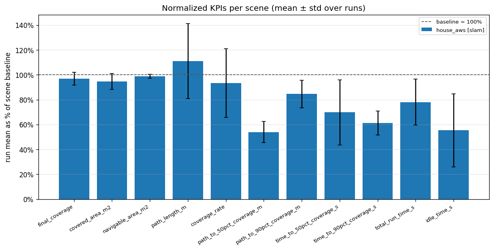

The dashed line at 100% is the human operator. Bars near it mean parity, bars below it mean the robot used less of that quantity. Coverage and covered area sit just under parity, distance driven sits just above at 111%, and the four bars on the right show where the robot is clearly better: it reaches 50% coverage in 54% of the baseline's distance, and spends 55% of the baseline's idle time. The error bar on distance is wide, reflecting the run-to-run variability of the endgame.

## Results

Map size is the strongest predictor of how this system behaves. The two environments differ by roughly 7.5x in area.

| House | Hospital | Warehouse |
|:---:|:---:|:---:|
| 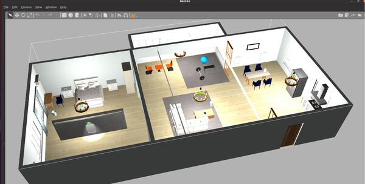 | 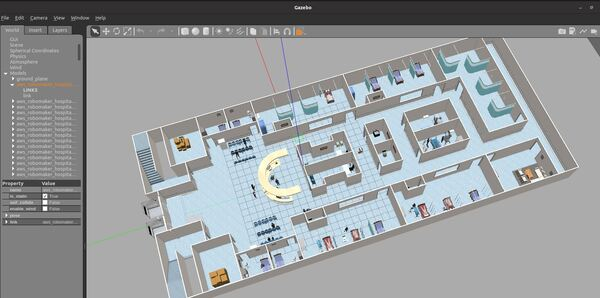 | 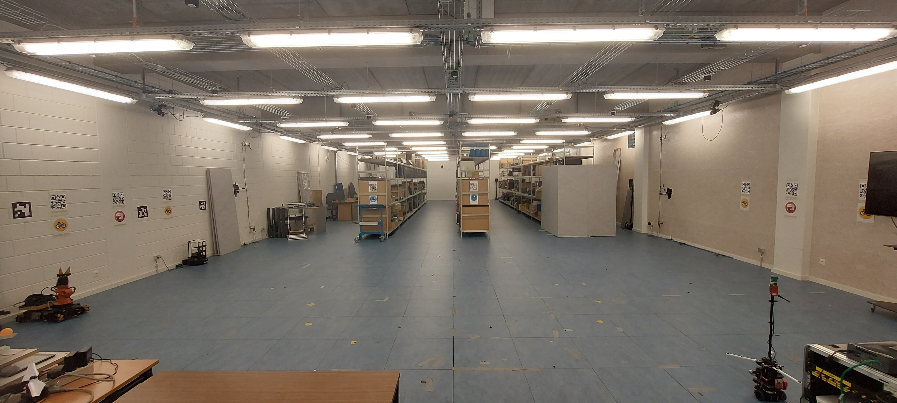 |

**House: 157 m^2**, open plan, few rooms, most of it within a couple of sensor ranges.

**Hospital: 1,171 m^2**, long corridors, many rooms, extensive clutter and numerous doorways.

**Warehouse: ~220 m^2**, the Ghent lab, four long racking aisles plus an open area. The only cohort run on a real robot (the picture slightly divert from the current layout due to regular reshaping).

### What grows with size

| Quantity | House | Hospital | Factor |
|---|---|---|---|
| Area | 157 m^2 | 1,171 m^2 | 7.5x |
| Planning cycles | 12.7 | 37 | 2.9x |
| Waypoints per run | 67 | 2,000 | 30x |
| Planning compute (mean) | 1.0 s (at measurement floor) | 7.5 s, std 16.4 s | >7.5x |
| Human assists | 0 in 10 runs | 6 in 4 runs | n/a |

Three cohorts have enough runs to support a conclusion, plus one large-scale SLAM run reported separately as indicative.

In each figure below, the thin pale lines are individual runs, the thick line is their mean, and the dashed black line is the human baseline. The left panel is coverage against time, the right is coverage against distance driven. 

### House, SLAM (6 runs)

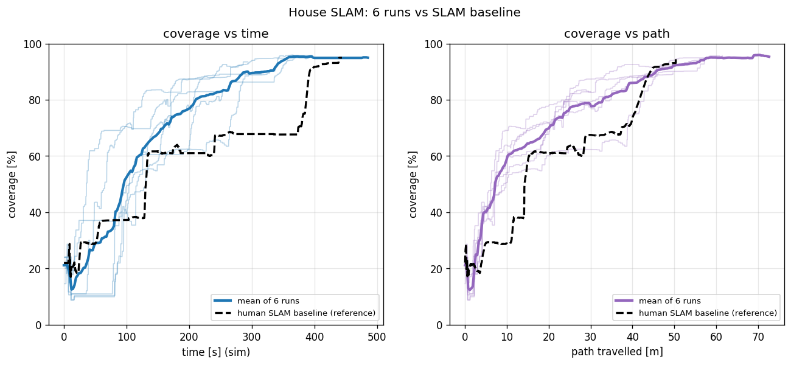

Mean final coverage 92.0%, which is 97% of the human baseline's. Mean path 55.9 m against 50.3 m, so 111% of the baseline's distance.

The robot's curve, right panel, rises above the human's over the first 40 m and stays there: at any given distance driven, the robot has seen more of the house than the person had. The human curve has long flat sections, visible around 20 m and again near 30 m, where the operator drove through already-seen space to reach somewhere new. The robot has fewer such plateaus because ordering the stops geodesically is exactly the problem a human solves poorly by eye.

The left panel shows the cost side. The robot's curve flattens near 95% but the run continues, in some cases for another 100 s. The autnomous exploration always cover the whole are (157m^2) in less than 7minutes.

A single run of this cohort, drawn on the map it built:

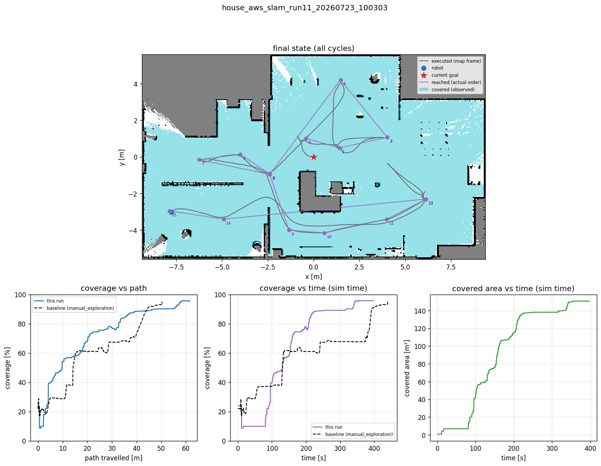

<video src="media/timelapse_house_slam_run11.mp4" controls muted loop width="100%"></video>

The full exploration and waypoints generation, start to finish. If the player above does not render, open [media/timelapse_house_slam_run11.mp4](media/timelapse_house_slam_run11.mp4) directly.

The pale blue is floor the robot looked at, and it is nearly the whole house. The grey line is the route: it loops through each area once and returns to the centre to move on, with no long crossings and very little retracing. Compare this shape with the hospital run in "Hospital, SLAM", where the same policy at 7.5 times the area produces a tangle of full-building traversals. That visual difference is the scale effect of the map dimesion, and this run is what the system looks like when it works: 95.8% coverage, 61 m driven, 0 aborted goals, terminated on its own.

### House, known map (4 runs)

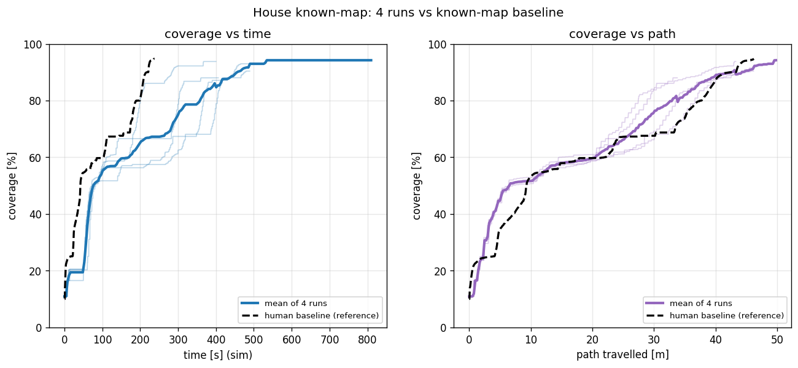

Mean final coverage 91.6%, again 97% of the baseline's. Mean path 43.3 m against 46.2 m, so 94%: with the map supplied in advance, the robot covers the house in slightly *less* distance than the human operator needed.

The right panel shows the two curves nearly superimposed for the first 20 m, then the robot pulling ahead between 20 m and 35 m, which is precisely the phase where the human backtracks. Both finish at about 94%.

The left panel is less flattering and worth being direct about: the robot takes substantially longer in wall-clock terms, 438 s mean against 238 s. It drives no further, so the difference is time spent stopped: planning cycles, and waiting on the navigation stack to settle at each goal pose. For an operator, the takeaway is that this system trades time for thoroughness and for not needing a driver.

### Hospital, known map (4 runs)

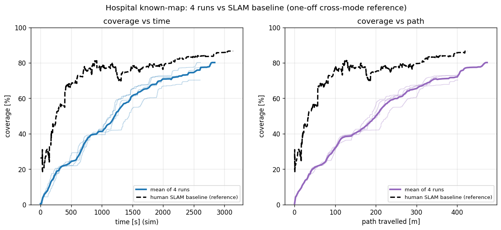

Mean final coverage 75.7%, 87% of the baseline's. Mean path 424.5 m against 426.4 m, effectively parity.

This is the cohort that shows the system's limit, and the figure should be read with two caveats visible in its own title. The baseline here is a SLAM human exploration borrowed as a one-off cross-mode reference.

The robot's curve sits below the human's throughout and plateaus around 80% while the human reaches 86.7%, and both curves reach their respective plateaus rather than continuing to climb. The robot is not slowly getting there. It stops making progress. The impact of large environment in planning is explained later.

### Hospital, SLAM (1 autonomous run)

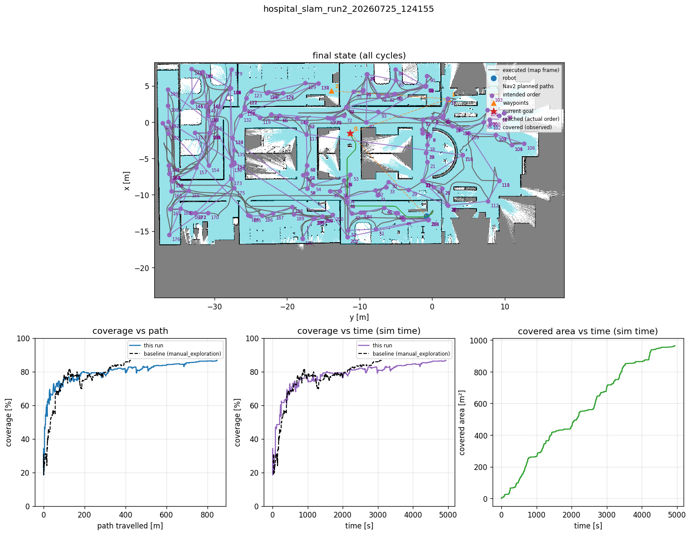

This run is included because it is the hardest thing the system has been asked to do: build the map and cover a 1,171 m^2 building at the same time.

It reached 86.69% coverage against the human baseline's 86.68%, but took 845.9 m against the baseline's 426.4 m, a 98% overshoot, over 82minutes, with two occasions where a human had to free the robot (teleop, nav2 stuck, the operator took a few minutes before realising it, which also count in the overtime). The two percentages are near-identical, but they are percentages of different things: in absolute terms the robot observed 964 m^2 against the human's 1047 m^2. Measured against the human's result that is 92%.

The top panel is the whole run drawn on the final map. The grey lines are where the robot actually went, the purple dots are the 200-plus waypoints in the order they were intended, and the long straight purple segments crossing the entire building are the problem: repeated traversals between distant parts of the hospital. The three panels below quantify it. Coverage against path reaches roughly 80% within the first 200 m and then creeps from 80% to 87% over the remaining 640 m. Three quarters of the distance driven bought the last seven points of coverage. "Current limitations" explains the mechanism.

### Warehouse, SLAM (3 runs, real robot)

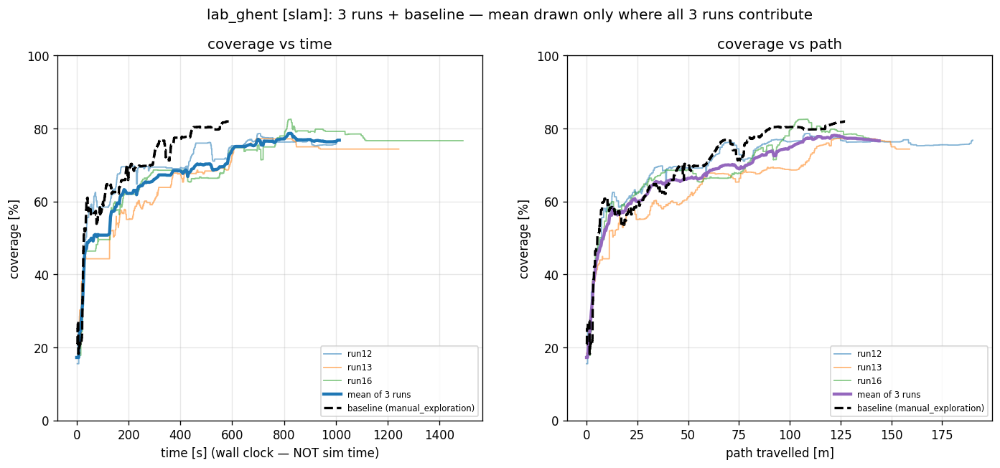

Mean final coverage 76.0% of the run's own achievable area, which is 94.5% of the human baseline once rescaled onto a common denominator (see "Three different denominators are in play" above, the same correction applies here). Mean path 164.4 m against the baseline's 127.2 m, so 129% of the baseline's distance.

This is recorded on a real robot, it shows the same front-loading behaviour as the simulated cohorts. Half of final coverage costs 5.2 m of path on average against the baseline's 5.3 m, essentially a tie. All three runs aborted at least one Nav2 goal, and the SLAM map itself froze partway through two of the three runs (an SSH map-transport issue, not a planning fault), which is why the achievable-area denominator needed reconstruction to compare cleanly against the baseline; the underlying `motion.csv` pose and path data used for the curves above were unaffected. Meanwhile the agent was able to continue exploring and reset new goals even after Nav2 falures. It took four attempts to obtain a usable human baseline for this scene: the aisles collapsed in the operator's own map on three of them, something that never happened during autonomous exploration, because redundant viewpoints keep re-observing the same walls.

Here a run, drawn on the map it built:

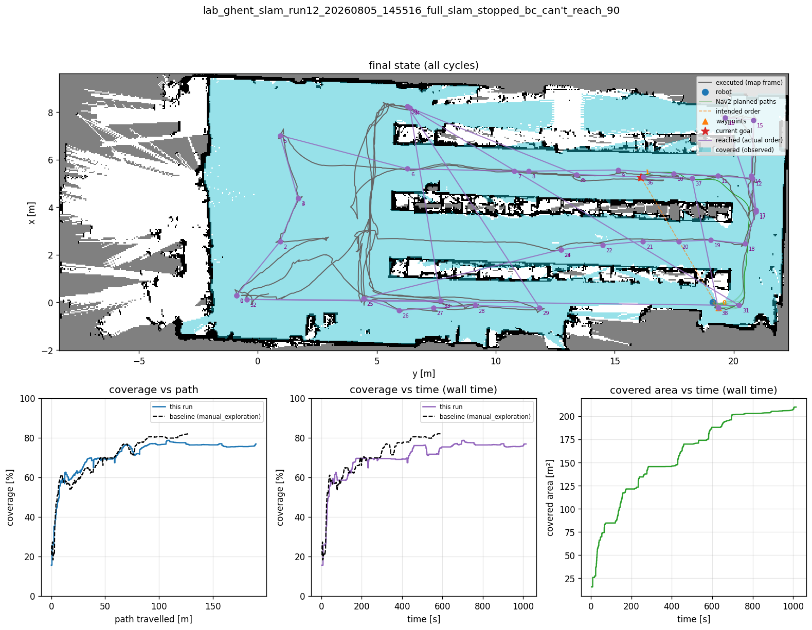

The purple route loops through each aisle once, similar in shape to the house SLAM run: no long crossings, and coverage plateaus near 80% by 100 m before the last 40 m chase scattered fragments.

### Warehouse, known map (3 runs, real robot)

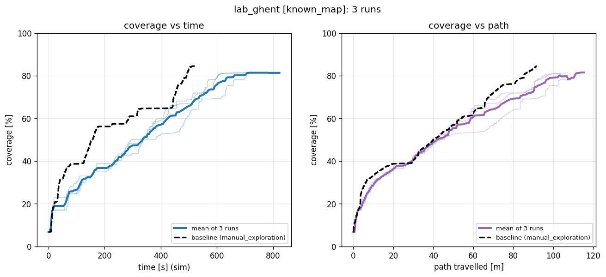

Mean final coverage 81.4%, 96.3% of the baseline's 84.5%. Mean path 108.8 m against 91.7 m, so 119% of the baseline's distance.

With the map supplied in advance the two curves track closely for the first 30 m before the robot pulls ahead, the same pattern seen in house known-map. All three runs needed a human to free the robot at least once (3 unstuck events across 3 runs) despite ending with zero aborted Nav2 goals. The agent also could not fully cover the whole area due to the chosen nav2 inflation area, some corridor were genuineky tie, yet a human could operate in those spaces. The threshold set to validate a clean exploration could not be satisfied: a 90% coverage gate against a human baseline that only reached 84.5%. The issues are stray Lidar scans and unreachable areas due to objects blocking the way. 

A single run of this cohort, drawn on the map it was given:

<video src="media/timelapse_warehouse_known_map_run4.gif" controls muted loop width="100%"></video>

The full exploration on the real robot, start to finish. If the player above does not render, open [media/timelapse_warehouse_known_map_run4.gif](media/timelapse_warehouse_known_map_run4.gif) directly.

## Runs that did not finish

Three of the four hospital known-map runs remain in the results tables despite not having ended on their own terms.

**In the hospital, no run should be expected to self-terminate.** The stopping condition requires both a coverage threshold and the absence of any remaining frontier. In a building of this size, with the termination conditions (90% coverage) and Nav2 inflation blocking doors, this leads to permanently unreachable pockets and the condition is effectively unsatisfiable.

The finding underneath this is that the completion criterion does not transfer from small to large buildings. It needs to be reformulated in terms of progress stalling rather than of frontiers being exhausted.

---

## Limitations brought by Nav2

The exploration takes into consideration that nav2 may fail, this does not stop the agent from replanning. Still Nav2 limitations are important to note:

Across the hospital known-map cohort, 150 navigation goals were aborted. Grouped by derived reason: `failed_near_goal` 88, `no_valid_path` 56, `stuck_no_progress` 3, `aborted_unknown` 3.

The distribution is the finding. `failed_near_goal` and `no_valid_path` together account for 96% of failures, and both describe the same situation: the exploration planner proposed a position the navigation stack could not service, typically a waypoint sitting between two inflated obstacles or the agent could not well turn to reach the desired orientation. The viewpoint selection is not choosing bad places to look. The boundary between the exploration strategy and the navigation stack is where runs degrade.

Concrete limits are worth an operator's attention.

**The navigation stack cannot plan from a pose that is itself inflated.** If the robot sits too close to an obstacle, every goal is rejected immediately, regardless of where the goal is. The exploration system checks that the robot's own pose is plannable before sending anything, and it will not cancel a goal in order to replan while in this state, it will wait for a human to move the robot out of the inflated area. The exploration send a message to ask to be moved.

**This version of the navigation stack returns no error code.** The action result carries no diagnostic information. Every abort reason in this document is therefore *inferred* from the goal's behaviour before it failed. The categories are reliable enough to support the conclusion above, since the two dominant ones are not easily confused, but they are an interpretation and not a measurement we could use to code improvements.

**In the real world, a reported failure is not taken at face value.** A declared failure is checked against the robot's actual measured position before the destination is given up on, so an arrival the navigation stack did not credit is not counted as work undone. This check also opens a short window in which a human can drive the robot the last stretch: as long as the robot is moving, the system keeps waiting rather than abandoning the destination, and if the human brings it close enough the destination counts as reached. Nothing needs to be switched on for this, and anything the camera sees during the intervention is kept. Separately, the navigation stack can be restarted, or die outright, without ending the run: the exploration system detects the silence, recovers, and reconnects on its own. The aborts counts in simulation did not consider this strategy.

---

## Real-robot considerations

**A reachable operator is part of the system.** By design the system does not attempt self-rescue: it does not reset its pose, re-initialise localisation, or take liberties with the map to escape. Its only automatic recovery is a rotation in place, used to regain clearance when the robot is wedged in the obstacle inflation band. That is a recovery manoeuvre, not an observation one. Beyond it, the system warns that the robot needs to be freed and waits. This is the right default for a real robot, since an autonomous escape attempt with a bad pose estimate can corrupt the map and turn a recoverable stop into a lost run, but it does mean the deployment must include someone who can respond.

**The operator can take the robot without ending the run.** Freeing a wedged robot is not the only way to help. A human can take manual control at any time, drive the robot wherever they judge useful (out of a pinch point, or simply away from somewhere it should not go), and hand it back; exploration continues underneath the whole time, and everything the camera observes while the human drives counts towards coverage exactly as if the robot had driven itself. Giving control back makes the system re-plan from wherever the robot was left, so a manual detour costs nothing beyond the time it takes.

**Assists scale with building size, not with run count.** Measured: 0 human interventions across all 10 house runs, 6 across the 4 hospital known-map runs, 2 in the single hospital SLAM run, 3 in the 3 Ghent Warehouse known map runs (0 in the 3 SLAM runs). Intervention frequency is a function of environment complexity.

**Footprint changes the result, not just the driving.** Obstacle inflation is robot-specific and is shared between the navigation stack and the exploration planner. A larger robot shrinks the navigable area, which shrinks the set of places it can stand, which shrinks what it can cover, and it widens the doorway-pinching effect of "Large buildings plateau". Coverage figures are not transferable between robots of different sizes.

**The robot does not support teleportation.** Take the robot and move it significantly while it explore and neither nav2 nor exploration will be able to recover. The joystick has to be used, else the odometry will not be able to follow the displacement. This is a limitation that was not considered at all.

**If recording over SSH, mind the system load.** Two of the three warehouse SLAM runs had their map and coverage tracking silently freeze mid-run: the map transport over SSH stalled under load, so `map_*` and `covered_mask_*` snapshots kept getting written but stopped changing from partway through the run onward, even though the robot kept exploring and its own `motion.csv`/`plans.csv` traces stayed live throughout. If you need to record over SSH, budget for the extra CPU and bandwidth this adds, or record locally on the robot instead.

Two gaps in particular should be expected to matter on a real robot: sensor noise and localisation drift are optimistic in simulation, and **dynamic obstacles are handled entirely by the navigation stack's local planner**, since the exploration planner works from a static snapshot of the map. In a building with people moving through it, the exploration layer will not react; it relies on the navigation stack to get around them and will simply re-plan later from whatever the map then says. Moreover, the exploration planning assume perfect odometry, and no Nav2 failure (no map scrumbling, no unrecognised drift) which is a pipe dream in my opinion. The warehouse cohort shows it tolerates real-robot drift well enough to still reach 94-96% of the human baseline, but this is a difficulty worth keeping in mind.

---

## Provenance and how to read the raw evidence

Every number and figure in this document is generated from recorded runs, not hand-picked. Each cohort's full per-run KPI table, aggregate statistics, known data-quality issues (map freezes, small-sample caveats, corrected vs. generated figures), and conclusions live in that cohort's own summary, which goes into more depth than this document does:

- House, SLAM / known map: `per_env_summaries/summary_house_[slam/known_map].md` 
- Hospital, SLAM: `per_env_summaries/report_hospital_slam.md` 
- Hospital, known map: `per_env_summaries/summary_hospital_known_map.md` 
- Warehouse, SLAM: `per_env_summaries/summary_ghent_warehouse_[slam/known_map].md`

Where this document simplifies a number (for example, quoting a single mean), the linked summary shows the full per-run breakdown, standard deviations, and which rows are statistically sound given the sample size, along with Nav2 abort reasons broken down per cohort.

For how the planner itself works (the scoring formula, greedy set cover, wall-aware ordering, replanning, and the Nav2-failure handling described above), see [`exploration_V2.0_technical_overview.md`](exploration_V2.0_technical_overview.md).

